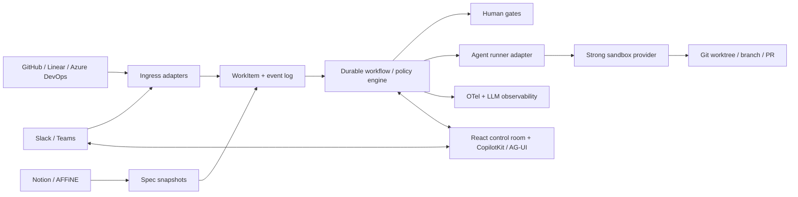

# Mercado de software factories agentic

**Fecha de corte:** 2026-08-24  
**Objetivo:** valorar producto propio, reutilización open source y compra de producto para una factory de software gobernada, observable y extensible.

## Resumen ejecutivo

No existe todavía una opción que cubra de forma madura, abierta y profundamente configurable toda la superficie pedida. El mercado se divide en cuatro capas que el marketing suele mezclar:

1. **Factories completas o control planes:** Mastra Factory, Warp Factories, Factory.ai Software Factory, Fusion.
2. **Orquestadores de trabajo:** OpenAI Symphony, Temporal, Microsoft Agent Framework.
3. **Runners y sandboxes de coding agents:** Sandcastle, E2B, Daytona como servicio comercial, Vercel Sandbox y Azure Container Apps Dynamic Sessions.
4. **Consolas e interacción humano-agente:** T3 Code, OpenHands Agent Canvas, Buzz, CopilotKit/AG-UI y Agent-Native.

La conclusión es **híbrida**:

- **Construir** el modelo de dominio, el control plane, la política, la UX operativa y los adapters de negocio. Ahí está la diferenciación y el “amor a la ingeniería”.
- **Reutilizar** un motor durable, protocolos y librerías de UI; no recrear colas, replay, tracing o harnesses de agentes.
- **Comprar o consumir** sandboxes de aislamiento fuerte e inferencia, detrás de interfaces sustituibles.
- Ejecutar un spike comparativo con **Mastra Factory** como baseline vertical, **Symphony** como referencia de kernel y **Sandcastle** como runner. Usar **Warp Factories, Factory.ai y Devin** como benchmarks de producto y opción de compra, no como fundamentos asumidos del desarrollo propio.

La opción más cercana a una base OSS vertical es **Mastra Factory**, pero está en alpha. La referencia comercial más completa de control room y gobierno es **Warp Factories**, también en Early Access. **Symphony** es deliberadamente un prototipo de orquestación, **Sandcastle** una librería de ejecución, **Cole Medin build-dark-factory** un blueprint, **Buzz** un workspace humano-agente y **T3 Code** una consola de agentes. Compararlos como si fueran productos equivalentes conduce a una decisión equivocada.

> **Distinción crítica:** en este informe, “determinista” significa que transiciones, gates, permisos, retries e idempotencia son código o configuración versionada. La decisión o el contenido generado por un LLM sigue siendo probabilístico.

## Método y nivel de evidencia

Se han usado exclusivamente fuentes primarias: documentación y webs oficiales, repositorios oficiales, licencias y posts de los autores. La “madurez” se expresa mediante las etiquetas de los propios proyectos, versiones, releases y advertencias; no por una puntuación subjetiva.

Convenciones de las matrices:

- **●** capacidad nativa y documentada.
- **◐** parcial, indirecta, delegada a un provider o apta como building block.
- **○** no encontrada en fuentes oficiales; no equivale a demostrar que sea imposible.
- **Preview** agrupa alpha, engineering preview, private preview y “very early”; se conserva el término exacto en el texto.

## 1. Los siete proyectos solicitados

### Matriz funcional

| Proyecto | Qué es realmente | UI / estado | Inbox / canales | Trackers y documentos | Git | Sandbox | Workflow gobernado | Telemetría | UI modificable | Madurez declarada |
|---|---|---:|---:|---:|---:|---:|---:|---:|---:|---|
| **Mastra Factory** | Factory vertical OSS | ● | ● Slack | ● GitHub, Linear; ○ Notion/AFFiNE/ADO | ● | ● cloud + fallback local | ● stages, gates, rules, typed workflows | ● traces/audit; ◐ cuadro ejecutivo | ◐ código React; no API estable de plugins UI | **Alpha**, `create-factory` 0.1.10 |
| **Warp Factories** | Control plane comercial | ● | ● Slack; Teams sólo confirmado en superficie comercial | ● GitHub/GitLab/Linear/Jira; ◐ ADO a nivel Warp Platform; ○ docs | ● | ● hosted; self-host execution Enterprise | ● definitions-as-code, gates, scorers | ● coste, autonomía, cycle time, benchmarks | ◐ factory muy configurable; ○ white-label/UI SDK | **Early Access**, schema `v1alpha1` |
| **OpenAI Symphony** | Spec + scheduler de referencia | ◐ dashboard mínimo | ○ mensajería | ● Linear/GitHub Issues/Jira/Asana/GitLab; ○ docs/ADO | ● workspace por issue | ◐ política Codex/workspace, no aislamiento fuerte exigido por spec | ● polling, concurrencia, retries, reconciliación, hooks | ◐ logs, estado, tokens/rate limits | ○ rich UI y multi-tenant son no-objetivos | **Engineering preview / prototype**, v0.0.2 |
| **Matt Pocock Sandcastle** | Librería TS de ejecución | ○ | ○ | ◐ GitHub Issues, Beads o custom | ● worktrees/branches/commits | ● Docker, Podman, Vercel, custom | ● pipelines en código, hooks, límites y outputs tipados | ◐ logs/sesiones; ○ fleet dashboard | ○ | **0.x**, v0.12.0 |
| **Cole Medin build-dark-factory** | Skill/blueprint instalable | ○ | ◐ GitHub Issues como cola | ● GitHub; ○ resto | ● | ◐ límites/protected paths, no sandbox fuerte documentado | ● state machine por labels, cron, gates y validación | ◐ estado en GitHub; ○ analytics agregado | ○ | Repo reciente, sin releases |
| **Block Buzz** | Workspace humano-agente self-hosted | ● | ● rooms/channels/threads/DM/mail | ◐ canvas; issues/multi-repo/merge coordinator aún diseñados | ● eventos y hosting git | ○ | ● YAML por eventos; approval gates aún en cableado | ● event log/audit; ◐ métricas de factory | ● forkable | **“Not finished”**, desktop-v0.5.18 |
| **T3 Code** | Control surface/harness de coding agents | ● web/desktop/móvil | ● threads, no Slack/Teams | ◐ SCM GitHub/GitLab/Bitbucket/ADO; ○ tracker/docs | ● worktree por thread, commit/push/PR | ◐ delega permisos/sandbox al provider | ○ motor durable/grafo | ● tokens/coste/cache/entorno | ● MIT, forkable y restylable | **“Very very early”**, v0.0.33 |

### 1.1 Mastra Factory

**Identidad.** [Mastra Factory](https://factory.mastra.ai/) es un entorno open source de entrega de software construido sobre Mastra. La plantilla canónica es [`mastra-ai/softwarefactory-template`](https://github.com/mastra-ai/softwarefactory-template) y la UI React vive en el [monorepo de Mastra](https://github.com/mastra-ai/mastra/tree/main/mastracode/factory-ui).

**Hechos verificados.** Ofrece agentes persistentes, workspaces de repositorio, board de intake y un flujo explícito **Intake → Triage → Planning → Building → Review → Done/Cancelled**. La aprobación del plan y el merge son gates humanos. Recibe issues/PRs de GitHub, issues de Linear y threads de Slack; documenta GitHub App, Linear OAuth, Postgres/pgvector, Redis y sandboxes cloud con fallback git local. La API de `MastraFactory` admite storage, auth, pub/sub, sandbox, reglas e integraciones; las reglas reaccionan a transiciones de board y eventos de tools, GitHub o Linear. Véanse la [guía de uso](https://factory.mastra.ai/usage), la [referencia](https://factory.mastra.ai/reference) y el [anuncio oficial](https://mastra.ai/blog/announcing-mastra-factory).

La plantilla declara **Apache-2.0** en README/metadata, aunque el repo separado no muestra un `LICENSE` raíz. El framework Mastra es estable 1.x, pero **Factory está etiquetada alpha** y puede introducir breaking changes sin major bump. `create-factory` figuraba en 0.1.10 el 2026-08-21 y la plantilla no tenía releases. [Mastra 1.0](https://mastra.ai/blog/announcing-mastra-1) no debe usarse para inferir estabilidad de Factory.

**Inferencia.** Es el mejor baseline vertical OSS para un prototipo: ya conecta board, intake, sesiones, GitHub/Linear/Slack y runtime. No es todavía una dependencia estable. Conviene tratar su UI y dominio como código que quizá se forke, no como una plataforma de plugins UI garantizada.

**No verificado.** Teams, Azure DevOps, Notion y AFFiNE; white-label o API estable de composición del dashboard; SLA; compatibilidad de upgrades alpha.

### 1.2 Warp Factories

**Identidad.** El nombre oficial es plural, [Warp Factories](https://www.warp.dev/factories), con [documentación específica](https://docs.warp.dev/factories/) y ejemplos en [`warpdotdev/warp-factory-examples`](https://github.com/warpdotdev/warp-factory-examples).

**Hechos verificados.** Es un producto comercial de control y ejecución. Un foreman coordina triage, especificación, implementación y review hasta una PR mergeable. La factory se declara como código versionado —repos, agentes, modelos/harnesses, skills, MCP, runners, triggers, permisos y gates— y se opera por dashboard, API, CLI, SDK o Factory MCP. Integra Slack, GitHub, GitLab, Linear y Jira; Teams aparece en la página comercial, pero no se encontró una guía equivalente a Slack. La plataforma Warp general documenta triggers de Azure DevOps y Bitbucket, sin demostrar la misma profundidad dentro del producto Factories.

El [dashboard](https://docs.warp.dev/factories/factory-dashboard/) cubre Activity por etapas, runs/subagentes, sesiones compartidas, coste por PR, cycle time, autonomía, agentes, automations, definición, scorers, self-improvement y benchmarks. Los sandboxes pueden ser Warp-hosted; [self-hosting](https://docs.warp.dev/factories/infrastructure-and-security/) mueve sólo el execution plane y está sujeto a Enterprise: coordinación, routing, configuración y observabilidad permanecen en Warp.

Está en **Early Access para equipos limitados**, anunciado el 2026-08-18, y la definición usa `v1alpha1`. No se publicó el control plane ni el dashboard bajo licencia OSS; la licencia MIT encontrada corresponde sólo a los ejemplos.

**Inferencia.** Es el benchmark más completo de experiencia operativa y el candidato “buy” más cercano al objetivo. “Open infrastructure” significa portabilidad de definiciones, harness/modelo y parte de ejecución, no control plane open source.

**No verificado.** UI embebible/white-label, Notion/AFFiNE, precio unitario definitivo, SLA o fecha de GA.

### 1.3 OpenAI Symphony

**Identidad.** [`openai/symphony`](https://github.com/openai/symphony) contiene una [especificación Draft v1](https://github.com/openai/symphony/blob/main/SPEC.md) y una [implementación de referencia Elixir/OTP](https://github.com/openai/symphony/blob/main/elixir/README.md), bajo **Apache-2.0**.

**Hechos verificados.** Es un daemon que lee trabajo de un tracker, crea un workspace aislado por issue y ejecuta Codex App Server bajo una política versionada en `WORKFLOW.md`. Implementa polling, elegibilidad, concurrencia acotada, reconciliación, cancelación al cambiar el estado, retries con exponential backoff, hooks y logs estructurados. La referencia actual incluye adapters para Linear, GitHub Issues, Jira Cloud, Asana y GitLab, además de un dashboard Phoenix LiveView y JSON API opcionales con trabajo bloqueado, estado, tokens/rate limits y logs.

La implementación configura políticas Codex `workspace-write` y sandbox por workspace, pero la spec deja el control de sandbox/approval a la implementación. El workspace evita colisiones; no equivale a una frontera de seguridad. Parte de blocked/retry/session state no es durable. El proyecto se presenta como **“low-key engineering preview for testing in trusted environments”** y la referencia como **“prototype software intended for evaluation only”**; release v0.0.2 de 2026-07-24.

**Inferencia.** Es una referencia excelente para el kernel: contratos, scheduler, adapters, workspaces, retries y reconciliación están separados con claridad. No es un producto de factory y su propia spec excluye rich UI, multi-tenancy y workflow engine general.

**No verificado.** Slack/Teams, Azure DevOps, Notion/AFFiNE, RBAC empresarial, SLA, persistencia durable completa o plugins UI.

### 1.4 Matt Pocock Sandcastle

**Identidad.** [`mattpocock/sandcastle`](https://github.com/mattpocock/sandcastle), paquete `@ai-hero/sandcastle`, es una librería TypeScript **MIT**.

**Hechos verificados.** `sandcastle.run()` ejecuta agentes de código y recoge sus commits. Incluye Claude Code, Pi, Codex, Cursor, OpenCode y Copilot; sandboxes Docker, Podman y Vercel, además de providers propios; estrategias git `head`, `merge-to-head` y branch explícita con worktrees; hooks, timeouts, límites de iteraciones, completion signals, output estructurado validado y resume de sesión. `sandcastle init` puede crear un tracker GitHub Issues, Beads o custom y plantillas de loop/reviewer/planner.

Su release más reciente era **v0.12.0** (2026-06-29), sin commits posteriores en `main` a la fecha de corte.

**Inferencia.** Es una buena primitiva para desacoplar control plane de runner y evitar escribir de cero worktrees, adapters de agentes y ciclo de sesión. El flujo TS que lo envuelve puede ser explícito; la generación no se vuelve determinista.

**No verificado.** Dashboard, inbox, flota multiusuario, RBAC, analytics, scheduler durable o conectores Slack/Teams/Linear/ADO/Notion/AFFiNE.

### 1.5 Cole Medin “Factory Skill”

**Identidad y ambigüedad.** No se encontró un producto oficial con el nombre exacto “Coleam Factory Skill”. El artefacto canónico del autor es [`build-dark-factory`](https://github.com/coleam00/skills/tree/main/.claude/skills/build-dark-factory), dentro de [`coleam00/skills`](https://github.com/coleam00/skills), bajo **MIT**. Ésta es la correspondencia usada en el informe.

**Hechos verificados.** Es un skill/procedimiento que recibe PRD + repo e instala cinco piezas: guidance, validation harness, workflow-driven repo, deployment y trigger autónomo. Usa issues/labels de GitHub como state machine y combina dispatcher, cron, plan, implementación, validación, review, commit, PR y merge gates. Incluye límites de coste, protected paths y holdout tests; se declara agent-agnostic. Las referencias de [automatización](https://github.com/coleam00/skills/blob/main/.claude/skills/build-dark-factory/references/automation.md) y [validation harness](https://github.com/coleam00/skills/blob/main/.claude/skills/build-dark-factory/references/validation-harness.md) contienen el diseño operativo.

El [experimento oficial](https://github.com/coleam00/dark-factory-experiment) se autocalifica **nivel 4, no 5**: humanos presentan issues y promueven releases; Archon ejecuta cuatro workflows. El repo de skills se creó el 2026-08-04, el skill se actualizó el 2026-08-14 y no hay releases. No debe heredarse la licencia MIT al repo experimental, que no declara una.

**Inferencia.** Es un blueprint ejecutable para construir la envolvente determinista de una factory, no un framework ni un control plane. Resulta útil para estudiar validation harness y separación entre perimeter/gates y agente.

**No verificado.** UI, Slack/Teams/Linear/ADO/Notion/AFFiNE, aislamiento fuerte, multi-tenancy o observabilidad agregada.

### 1.6 Buzz, de Block

**Identidad y ambigüedad.** Se ha interpretado “Buzz” como [`block/buzz`](https://github.com/block/buzz), workspace humano-agente autoalojable de Block, bajo **Apache-2.0**. Si se pretendía otro Buzz, esta entrada debe revisarse.

**Hechos verificados.** Buzz construye rooms, channels, threads, DM, canvases, media, search y audit sobre un relay Nostr propio. Humanos y agentes tienen identidad y membresía; mensajes, reacciones, workflows, revisiones y eventos git quedan firmados en un event log. Incluye desktop Tauri/React, CLI JSON y ACP para Goose/Codex/Claude Code, además de workflows YAML con triggers de message, reaction, schedule y webhook. Publica eventos y hosting Git.

El README distingue [“Works today / Being wired up / Strong opinions pending code”](https://github.com/block/buzz#works-today--being-wired-up--strong-opinions-pending-code) y dice **“Not finished”**. Approval gates están aún “being wired”; project binding, multi-repo, merge coordinator e issues NIP-34 aparecen diseñados, no entregados, en [VISION_PROJECTS](https://github.com/block/buzz/blob/main/VISION_PROJECTS.md). Release desktop-v0.5.18 de 2026-08-21 y actividad en `main` el 2026-08-24.

**Inferencia.** Es el sustrato OSS más interesante para inbox, colaboración, canvas y audit humano-agente. Su event log podría alimentar una factory, pero el forge/factory end-to-end no está terminado.

**No verificado.** Conectores Slack/Teams/Linear/ADO/Notion/AFFiNE, sandbox de ejecución o dashboard agregado de coste/calidad.

### 1.7 T3 Code

**Identidad.** [T3 Code](https://t3.codes/) y [`pingdotgg/t3code`](https://github.com/pingdotgg/t3code), bajo **MIT**.

**Hechos verificados.** Es un control surface/harness web, Electron e iOS/Android para Codex, Claude, OpenCode, Cursor y Grok, con suscripción del usuario. Ofrece proyectos/threads, background threads, worktree por thread, estados pinned/active/settled, commit/push/PR, GitHub/GitLab/Bitbucket/Azure DevOps como source control, acceso remoto y métricas de tokens, coste, caché, modelo y entorno. Sus cuatro modos de permiso se traducen al sandbox/approval del provider. La documentación oficial está en [`docs/user`](https://github.com/pingdotgg/t3code/tree/main/docs/user).

El sitio promete cambiar UI, añadir agentes, self-host y distribuir forks. El README advierte **“very very early, expect bugs”**; release v0.0.33 de 2026-08-10 y actividad el día de corte.

**Inferencia.** Es el candidato más claro para estudiar o forkar una consola de operador de coding agents. No sustituye backlog, event ingestion ni workflow durable.

**No verificado.** Motor de workflows, Slack/Teams, trackers de issues, Notion/AFFiNE o sandbox propio independiente del provider.

## 2. Alternativas de producto

| Opción | Modalidad y madurez | Capacidades verificadas | Encaje / límite |
|---|---|---|---|
| [Fusion](https://github.com/Runfusion/Fusion) | OSS **MIT**, activo; varios runtime plugins se marcan experimentales | Dashboard kanban/list/graph, Command Center, tokens/productividad/actividad/señales, mailbox y approvals, chat/rooms, visual workflow editor, agents/missions, worktrees, GitHub issue/PR | La alternativa OSS más amplia para experimentar; superficie enorme y rápida evolución. GitHub es el tracker nativo documentado; no se verifican ADO/Linear/docs/canales corporativos |
| [OpenHands Agent Canvas](https://github.com/OpenHands/OpenHands) | Core **MIT**; cloud/enterprise comerciales y `enterprise/` source-available | Control center self-host para OpenHands, Claude Code, Codex, Gemini y ACP; backends local/Docker/VM/cloud; automations por schedule/webhook con Slack, GitHub, Linear y Notion | Base de consola y automation madura/extendida; el propio README advierte que sin sandbox el agente accede al filesystem host. No es una factory SDLC completa |
| [Supaku AgentFactory](https://github.com/LiteTrackerApp/agentfactory) | OSS **MIT**, sin releases y 0 stars a la fecha: extremadamente temprano | Backlog Linear → dev/QA/acceptance, Claude/Codex/Amp, worktrees, Redis worker pool, crash recovery, token/coste; `sandboxEnabled` existe pero default `false` | Coincide bien con el dominio, pero su juventud lo limita a lectura/spike, no dependencia estratégica |
| [Factory.ai Software Factory](https://docs.factory.ai/software-factory/overview) | Comercial propietario; **Private Preview** | Dashboard de cobertura SDLC: triage, code-gen, validate, release, document, monitor; métricas de throughput/queue/pass rate/cycle time; GitHub/Slack/Linear/GitLab; [connectors](https://docs.factory.ai/harness/connectors) GitHub/Linear/Notion/Slack; Missions, Droid Computers, OTEL y analytics | Benchmark comercial directo. La factory completa aún no es disponibilidad general; el repo público de Factory conserva copyright/all rights reserved |
| [Devin](https://docs.devin.ai/integrations/overview) | SaaS/Enterprise propietario | GitHub/GHE/GitLab/Bitbucket/**Azure DevOps**, Slack/**Teams**, Jira/Linear, MCP para Notion/Confluence, API, schedules, playbooks, [métricas](https://docs.devin.ai/api-reference/v3/metrics/metrics-sessions) y [audit logs](https://docs.devin.ai/api-reference/v3/audit-logs/enterprise-audit-logs) | Mejor opción “buy” si prima amplitud de integración y operación empresarial. Menos control sobre dominio, UI y runtime |
| [Codegen](https://docs.codegen.com/integrations/integrations) | SaaS propietario | Dashboard/API/CLI; sesiones desde Slack, GitHub, Linear/Jira y otros trackers; Notion/Figma; [sandboxes aislados](https://docs.codegen.com/capabilities/capabilities) y seguimiento de PR/CI | Alternativa comercial sólida para ticket/conversación → PR. No se verificaron Teams ni Azure DevOps, y no sustituye una UI/control plane profundamente propios |
| [GitHub Copilot cloud agent](https://docs.github.com/en/copilot/how-tos/copilot-on-github/use-copilot-agents/kick-off-a-task) | Comercial en planes Copilot; partner/third-party agents en **public preview** | Issues/prompts → branch/PR, revisión/iteración, Agents UI, móvil/VS Code, custom agents/MCP; Codex y Claude como third-party agents; Slack/Teams en preview | Compra pragmática cuando GitHub es system of record. No resuelve ADO-first, docs, factory multi-etapa ni UI propia |

**Lectura del mercado.** Fusion y OpenHands son los comparables OSS que merecen un spike junto a Mastra. Factory.ai, Warp y Devin permiten validar rápidamente el techo funcional y el coste de oportunidad. GitHub Copilot es una alternativa estrecha pero de baja fricción si se acepta GitHub como centro del proceso.

## 3. Opciones por capacidad

### 3.1 UI, dashboard, inbox y personalización

#### CopilotKit + AG-UI

[CopilotKit](https://github.com/CopilotKit/CopilotKit) es un stack OSS MIT para chat, tool rendering, shared state, human-in-the-loop, headless UI y generative UI. Es un repo amplio y activamente desarrollado; no se encontró una etiqueta oficial única de GA/estabilidad para toda su superficie. Su [Channels SDK](https://github.com/CopilotKit/channels-sdk) —también MIT— conecta agentes AG-UI con Slack y Teams, renderiza Slack Block Kit/Teams Adaptive Cards y permite approvals dentro de la conversación.

[AG-UI](https://github.com/ag-ui-protocol/ag-ui), bajo **MIT**, aporta transporte de eventos, streaming, tool calls, snapshots/deltas de estado y HITL entre agente y aplicación. Mantiene un roadmap público, pero no se encontró un compromiso general de compatibilidad estable para todas las integraciones. **No es una especificación de UI**: la propia documentación de CopilotKit separa AG-UI como runtime bidireccional de A2UI, Open-JSON-UI o MCP Apps para describir interfaces. Eso lo hace buen contrato para desacoplar frontend y runtimes, pero no genera por sí solo dashboard, navegación, RBAC o modelo de datos.

**Encaje recomendado:** CopilotKit/AG-UI para el panel conversacional, streaming de runs, approvals y canales; componentes React normales y schema-driven para el dashboard crítico. La [Open Generative UI](https://github.com/CopilotKit/CopilotKit/blob/main/showcase/shell-docs/src/content/docs/generative-ui/open-generative-ui.mdx) se ejecuta en iframe aislado, que no debe confundirse con el sandbox donde corre código del repositorio.

#### Agent-Native

[`BuilderIO/agent-native`](https://github.com/BuilderIO/agent-native) es un framework **MIT**. Una acción `defineAction()` comparte schema y ejecución entre agente, hooks de UI, HTTP, CLI, MCP y A2A, con validación, permisos y audit. Su [Code Agents UI](https://www.agent-native.com/docs/code-agents-ui/) ofrece un workspace React reutilizable para sesiones Claude Code/Codex/Pi mediante un contrato `CodeAgentsHost`. No se encontró una declaración de GA o compatibilidad estable; debe considerarse una opción joven y validarse mediante spike.

**Encaje recomendado:** excelente patrón para que “botón” y “tool” no diverjan, y posible base greenfield si se acepta un framework joven. Frente a CopilotKit, aporta una opinión más fuerte sobre toda la aplicación; existe más riesgo de acoplar dominio, UI y runtime a una superficie todavía cambiante.

#### Decisión UI

- **Core operativo:** UI declarativa y predecible —board, run detail, diff, gates, permisos, costes, incidentes— con widgets registrados y schemas versionados.
- **Superficie agentic:** CopilotKit + AG-UI para chat, streaming, tool activities, approvals y canales.
- **Generative UI abierta:** limitarla a análisis, visualizaciones y formularios no privilegiados. Acciones sensibles pasan siempre por contratos tipados, authz y audit.
- **Referencias de consola:** T3 Code y OpenHands Canvas. **Referencia de inbox colaborativo:** Buzz.

### 3.2 Slack y Microsoft Teams

Tres caminos válidos:

1. **CopilotKit Channels**, el camino TypeScript más corto y multicanal, con UI nativa y AG-UI.
2. **Adapters directos**, con [Slack Bolt](https://docs.slack.dev/tools/bolt-js/) y el [Teams SDK](https://learn.microsoft.com/en-us/microsoftteams/platform/teams-sdk/), si se necesitan control fino, identidad corporativa, Adaptive Cards, Graph, proactive messaging o requisitos de tenant.
3. **Comprar el canal integrado** con Warp/Devin/Factory.ai, aceptando su control plane.

Recomendación: normalizar cada entrada a un `WorkItem` inmutable con `source`, `sourceId`, actor, conversation/thread, attachments, permisos y correlation ID. El canal no debe ejecutar directamente el coding agent; publica un comando idempotente al workflow.

### 3.3 Azure DevOps, Linear y GitHub

- **Azure DevOps:** Work Items REST + [Service Hooks/Webhooks](https://learn.microsoft.com/en-us/azure/devops/service-hooks/overview?view=azure-devops). Los webhooks envían el evento JSON a un endpoint público; después se obtiene el estado autoritativo por API. Devin ofrece integración nativa; Warp sólo confirma ADO en su Automation Platform general; T3 lo soporta como SCM, no como intake de work items.
- **Linear:** GraphQL y [webhooks](https://linear.app/developers/webhooks). La nueva [Agent API](https://linear.app/developers/agents) permite que el agente sea app user, reciba asignaciones/@mentions y muestre un `AgentSession` visible, pero está en **Developer Preview**. Es la integración con mejor UX nativa para una factory nueva.
- **GitHub:** una [GitHub App](https://docs.github.com/en/apps/overview) es preferible a OAuth: permisos finos, selección de repos y tokens cortos. Debe solicitar el mínimo de permisos y usar webhooks firmados. Es además el punto de integración más ampliamente soportado por las factories evaluadas.

**Diseño:** un port `WorkTracker` con capacidades negociadas (`watch`, `claim`, `comment`, `transition`, `attachRun`, `linkPR`) y adapters delgados. No intentar esconder todas las diferencias bajo un CRUD común; Linear Agent Sessions no tiene equivalente exacto en Azure Boards.

### 3.4 Notion y AFFiNE

- El [Notion MCP oficial](https://developers.notion.com/guides/mcp/overview) es hosted, OAuth y read/write. Notion advierte que OAuth requiere interacción y [puede no servir para agentes cloud headless](https://developers.notion.com/guides/mcp/get-started-with-mcp). Para ejecución desatendida debe preferirse la API REST/webhooks con una integration propia; el MCP OSS con bearer token ya no está activamente mantenido.
- El [MCP oficial de AFFiNE](https://affine.pro/mcp) está integrado en cloud y self-host, usa credenciales revocables por workspace y streamable HTTP. Search/read está disponible; `create_document`, `update_document` y `update_document_meta` están en **rolling rollout**, por lo que hay que detectar capacidades en cada workspace. El repositorio [AFFiNE](https://github.com/toeverything/AFFiNE) mezcla MIT y licencias de backend/EE: revisar rutas/licencia antes de forkar o redistribuir, no asumir que todo el monorepo es MIT.

**Diseño:** tratar documentos como fuentes versionadas de specs, no como estado del workflow. Al comenzar una run se captura `SpecSnapshot` con URI, revision/hash y contenido normalizado. Las modificaciones posteriores generan un nuevo evento y una decisión explícita de replanificación.

### 3.5 Git y aislamiento

Separar dos conceptos:

- **Aislamiento lógico:** branch/worktree por task; evita colisiones y facilita diff/merge.
- **Aislamiento de seguridad:** VM/microVM/kernel dedicado, secretos mediante broker, egress policy, cuotas y destrucción verificable.

Un worktree o contenedor local no es por sí solo una frontera suficiente para código no confiable.

| Sandbox | Modalidad/licencia | Hechos relevantes | Uso recomendado |
|---|---|---|---|
| [E2B](https://github.com/e2b-dev/E2B) | Cloud + self-host; core **Apache-2.0**; release `e2b@2.26.0` | JS/Python SDK, sandboxes cloud aislados; self-host Terraform en AWS/GCP, Azure aún no marcado como soportado | Buen provider portable si AWS/GCP encajan |
| [Daytona](https://github.com/daytonaio/daytona) | Plataforma comercial activa; último snapshot público **AGPL-3.0**, pero el repo OSS dejó de mantenerse en junio de 2026 | Servicio con kernel/filesystem/network aislados, snapshots, SDK/API/CLI, dashboard, audit, OTEL, git, PTY/VNC | Evaluarlo como proveedor gestionado. No elegir el repo público como base OSS salvo aceptar un fork congelado, sin fixes ni soporte |
| [Azure Container Apps Dynamic Sessions](https://learn.microsoft.com/en-us/azure/container-apps/sessions) | Servicio Azure documentado para producción; algunas APIs concretas siguen Preview | Hyper-V por sesión, pool prewarmed, custom containers, Entra/RBAC, network controls, destrucción automática | Preferencia para entorno Azure/Teams/ADO y requisitos enterprise |
| [Vercel Sandbox](https://vercel.com/docs/sandbox) | Comercial; SDK/CLI abiertos; **GA** desde 2026-01-30 | Firecracker microVM, filesystem/red propios, snapshots, OCI, TS/Python | Excelente DX TypeScript y workloads de hasta 24 h según plan |
| Sandcastle providers | MIT library + coste del provider | Abstracción Docker/Podman/Vercel/custom con integración git | Runner POC; sustituir Docker local por provider fuerte en producción |

Requisito mínimo del port `SandboxProvider`: create desde imagen/snapshot, mount/clone controlado, exec/stream, puertos preview, artifacts, kill, TTL, cuotas CPU/RAM, egress allowlist, secret brokerage y attestación de teardown.

### 3.6 Agentes, workflows deterministas y durabilidad

| Opción | Licencia/modalidad | Fortalezas | Límite |
|---|---|---|---|
| [Temporal](https://github.com/temporalio/temporal) | Server **MIT** + Cloud comercial; proyecto se declara maduro | Durable execution, retries, timers, signals, replay, Web UI; Workflow code determinista y side effects en Activities | Más infraestructura y disciplina; no contiene agentes ni UI de factory |
| [Microsoft Agent Framework](https://github.com/microsoft/agent-framework) | **MIT**, SDK Microsoft | Agents + [graph workflows](https://learn.microsoft.com/en-us/agent-framework/overview/), routing tipado, fan-out/in, checkpoints, HITL y OTEL; [YAML declarativo](https://learn.microsoft.com/en-us/agent-framework/workflows/declarative) | El framework actual usa paquetes/previews en partes; no sustituye un control plane de producto |
| [LangGraph](https://github.com/langchain-ai/langgraph) | **MIT** + LangSmith comercial | Grafos stateful, checkpoints, HITL, memoria y debugging | Orquestación de agentes más que durable business process general |
| Mastra Workflows | Core mayoritariamente Apache-2.0, algunas rutas `ee/` bajo licencia enterprise | TypeScript, steps tipados, schedules, memory/storage y Studio | Factory sigue alpha; verificar licencias por ruta y semántica durable requerida |
| [OpenAI Agents SDK](https://github.com/openai/openai-agents-python) | **MIT** | Loop ligero, tools, guardrails, handoffs, sessions, HITL y tracing | No es por sí solo un motor durable de workflow |

**Recomendación:** Temporal como backbone cuando las runs pueden durar horas/días, esperar aprobación y sobrevivir despliegues; activities para LLM, tracker, git y sandbox. Si el stack y la organización son fuertemente Azure/.NET, Microsoft Agent Framework es un candidato de spike para el grafo agente, incluso ejecutado dentro de activities de Temporal. No hace falta introducir ambos el primer día: un vertical slice puede comenzar con Mastra Workflows y una interfaz que permita sustituir el motor.

### 3.7 Telemetría, auditoría y evaluación

- Instrumentar desde el inicio con [OpenTelemetry](https://opentelemetry.io/docs/): es un estándar vendor-neutral para traces, metrics y logs, no un backend.
- [Langfuse](https://github.com/langfuse/langfuse) añade traces LLM, sesiones, coste/tokens, prompt management, datasets y evaluaciones; tiene cloud y [self-host](https://github.com/langfuse/langfuse-docs/blob/main/content/self-hosting/index.mdx). El core es MIT con funciones adicionales que requieren licencia.
- Conservar además un **event log de dominio**: `WorkReceived`, `PlanApproved`, `SandboxStarted`, `CommitProduced`, `GateFailed`, `PRLinked`, `RunCancelled`. Una traza puede muestrearse o expirar; el audit de decisiones no.

KPIs iniciales: queue age, time-to-plan, approval wait, lead time, retry rate, sandbox minutes, tokens/coste por outcome, PR acceptance/rework, gate failure por clase, incidents post-merge y porcentaje de escalaciones humanas. Evitar “líneas de código” como métrica principal.

## 4. Arquitectura propia recomendada

### Límites de módulo

1. **Domain/control plane:** WorkItem, SpecSnapshot, Run, Attempt, Stage, Gate, Artifact, Approval, Policy, CostRecord e Incident. Propiedad propia.
2. **Ingress:** adapters event-driven e idempotentes; verifican firma, guardan raw envelope y normalizan sin perder source semantics.
3. **Workflow:** state machine durable. Sólo esta capa cambia el estado autoritativo.
4. **Runner:** contrato para Codex/Claude/ACP/Sandcastle/OpenHands; emite eventos, no muta directamente el tracker.
5. **Execution:** provider de sandbox sustituible; secretos y network policy fuera del prompt/agente.
6. **SCM:** GitHub App/ADO/GitLab; branch protections y CI son gates externos autoritativos.
7. **UI:** read model para dashboard + command API. AG-UI transmite actividad agentic, no gobierna permisos.
8. **Observability:** OTel para operación, Langfuse para LLM/evals y event log para audit.

Empezaría como **modular monolith + workers**, Postgres y object storage. La separación anterior son interfaces y ownership, no una invitación a crear ocho microservicios.

## 5. Build vs buy vs hybrid

| Estrategia | Ventajas | Riesgos | Cuándo elegirla |
|---|---|---|---|
| **Build** | Máximo control de UI, dominio, seguridad, proveedores y datos; aprendizaje | Se recrean capacidades difíciles: durabilidad, aislamiento, canales, auth/RBAC, audit, upgrades | Cuando la factory es producto estratégico y existe equipo de plataforma sostenido |
| **Buy** | Tiempo de valor y operación resuelta; integraciones enterprise | Lock-in de control plane/UI/datos; Early/Private Preview en los comparables más cercanos; menor libertad de experimentación | Cuando automatizar el SDLC importa más que construir la plataforma |
| **Hybrid — recomendado** | Conserva diferenciación y reduce riesgo en infraestructura commodity | Exige buenos contratos y pruebas de portabilidad | Cuando se quiere producto propio sin convertir sandbox/workflow/telemetry en proyectos paralelos |

### Decisión propuesta

1. **No comprar todavía como decisión irreversible.** Warp está Early Access y Factory.ai Private Preview; ambos merecen pilotos y sirven para obtener un benchmark real de UX/coste.
2. **No forkar inmediatamente una factory enorme.** Evaluar Mastra Factory y Fusion con el mismo caso real. El fork prematuro convierte el ritmo upstream en deuda propia.
3. **Construir un tracer bullet:** issue de GitHub/Linear/ADO → spec snapshot → plan → approval → sandbox → commit/PR → CI/review gate → cierre, con replay y audit.
4. **UI propia ligera:** React + CopilotKit/AG-UI. Reutilizar patrones/componentes de T3 Code u OpenHands sólo si su licencia y arquitectura encajan; core dashboard no generativo.
5. **Ejecutor inicial:** Sandcastle o adapter directo a Codex/Claude; producción en Azure Dynamic Sessions si Azure es el entorno objetivo, con E2B/Vercel y, si se acepta un proveedor gestionado, Daytona detrás del mismo port.
6. **Durabilidad:** Temporal si desde el primer piloto hay waits/retries largos y múltiples sistemas; en un spike corto, Mastra Workflows puede validar el dominio antes de asumir esa operación.

## 6. Spike de decisión

Un spike útil no debe ser una demo de “el agente escribe código”, sino la misma prueba sobre varios stacks:

- Un bug real con tests reproducibles.
- Entrada por un tracker y una conversación.
- Spec leída desde Notion o AFFiNE y congelada por revisión/hash.
- Aprobación de plan, ejecución aislada, CI, review y PR.
- Reinicio del orchestrator a mitad de run.
- Webhook duplicado y fuera de orden.
- Timeout, cancelación y retry sin duplicar PR/commit.
- Secreto disponible para una herramienta autorizada pero no visible en sandbox/prompt/log.
- Dashboard que explique estado, bloqueo, coste y siguiente acción.

Comparar tres rutas:

| Ruta | Hipótesis que valida |
|---|---|
| **Mastra Factory extendida** | Cuánto producto vertical se reutiliza antes de chocar con alpha, UI o adapters faltantes |
| **Kernel propio inspirado en Symphony + Sandcastle** | Coste real de tener dominio/UI propios y una capa de ejecución pequeña |
| **Piloto Warp o Factory.ai/Devin** | Tiempo de valor, calidad, gobierno, coste por outcome y gaps de customización de un buy |

Criterios de salida: recovery correcto, idempotencia, isolation test, tasa de PR aceptable, explicabilidad operativa, effort para un segundo tracker/canal y capacidad de sustituir provider sin migrar el dominio.

## 7. Roadmap propuesto

| Fase | Entrega | Decisión que desbloquea |
|---|---|---|
| **0. Contrato y benchmark** | Ubiquitous language, estados/gates, threat model, NFR, dataset de 10–20 tareas reales y demo equivalente en Mastra/Warp o Factory.ai/Devin | Qué comprar, qué reutilizar y qué significa éxito con evidencia propia |
| **1. Tracer bullet** | Un repo y un tracker; spec snapshot; plan + approval; un runner; sandbox fuerte; PR + CI; dashboard de runs; event log y OTel | Viabilidad del dominio/control plane propio y del stack UI/runner |
| **2. Recuperación y gobierno** | Workflow durable, idempotencia/replay, cancelación, quotas, RBAC, secret broker, egress policy, audit export y evaluaciones offline/online | Si la plataforma puede operar sin supervisión constante y superar revisión de seguridad |
| **3. Superficies e integraciones** | Segundo tracker, Slack + Teams, Notion + AFFiNE, fleet inbox, coste/outcome y API/SDK de widgets/actions | Si los adapters y la UI son realmente extensibles sin contaminar el núcleo |
| **4. Escala y aprendizaje** | Multi-repo, pools de runners, policy-as-code, progressive autonomy, feedback de producción, scorers versionados y SLO | Qué workloads pueden elevarse de asistidos a autónomos y con qué límites |

Cada fase debe conservar una salida de **buy**: comparar coste por outcome, tasa de aceptación, recuperación, seguridad y esfuerzo de integración contra el piloto comercial. El roadmap no presupone que todo deba construirse.

## 8. Riesgos y asuntos no verificables

- **Nombres ambiguos:** “Coleam Factory Skill” se mapeó a Cole Medin `build-dark-factory`; “Buzz” se mapeó a Block Buzz.
- **Marketing vs disponibilidad:** Teams en Warp aparece en superficie comercial, no con guía de Factories equivalente a Slack. Las escrituras AFFiNE MCP están en rollout. Linear Agent API está en Developer Preview.
- **Licencias compuestas:** Mastra tiene rutas `ee/`; AFFiNE combina licencias por ruta; OpenHands separa core MIT y `enterprise/`; Langfuse tiene add-ons licenciados; el último código público de Daytona es AGPL. Hacer revisión legal del commit exacto antes de incorporar o redistribuir.
- **Continuidad OSS:** el [repositorio público de Daytona](https://github.com/daytonaio/daytona) declara que no recibe actualizaciones, fixes ni releases desde junio de 2026 porque el desarrollo principal pasó a código privado. La plataforma comercial puede seguir siendo evaluable, pero no es una base OSS mantenida.
- **Self-host no significa control total:** Warp self-host mueve ejecución pero mantiene el control plane. Factory.ai documenta modos cloud/hybrid/airgapped por plan. Notion MCP oficial sigue hosted y OAuth.
- **Sandbox nominal:** worktree, `workspace-write`, Docker local y modo de permisos de un harness no son equivalentes a microVM/Hyper-V y egress controlado.
- **No se verificaron** SLA, TCO comparable, tasas de éxito en el código del usuario ni compatibilidad futura de APIs preview. Requieren piloto y propuesta comercial, no pueden deducirse de repositorios.

## Recomendación final

Construiría una **factory propia híbrida** y deliberadamente pequeña en el centro:

- dominio, policy engine, event log y UI operativa propios;
- CopilotKit/AG-UI como capa de interacción, con dashboards convencionales para decisiones críticas;
- adapters GitHub/Linear/Azure DevOps y Notion/AFFiNE basados en APIs/webhooks, no en prompts;
- Temporal como destino de durabilidad, Sandcastle/OpenHands/Agents SDK detrás de un runner port;
- Azure Dynamic Sessions o un proveedor microVM equivalente para producción;
- OTel + Langfuse y audit de dominio desde la primera run.

Mastra Factory debe ser el primer baseline a ejecutar, no una elección automática. Si su alpha permite añadir ADO/Teams/docs y conservar la UI sin forkar grandes superficies, acelera mucho. Si esos puntos requieren cirugía, el diseño Symphony + runner pequeño ofrece un núcleo más controlable. Warp, Factory.ai y Devin deben pilotarse en paralelo como precio de referencia: si alcanzan los resultados con gobierno suficiente, ayudan a decidir qué partes del producto propio aportan valor y cuáles son hobby engineering.

La tesis final es: **poseer el control plane y la experiencia; alquilar el aislamiento y la inferencia; reutilizar durabilidad, protocolos y observabilidad**.
